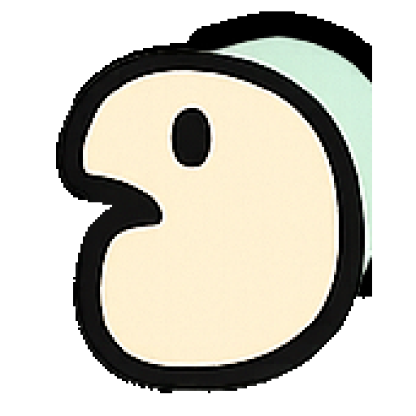

# Yappr



Local push-to-talk dictation and voice chat for macOS.

## Install

With Homebrew:

```bash
brew install rpwr021/yappr/yappr
```

Or with the install script:

```bash
curl -fsSL https://raw.githubusercontent.com/rpwr021/yappr/main/install.sh | bash
```

Either method installs `/Applications/Yappr.app` and launches it. Update a
Homebrew install with `brew upgrade --cask yappr`.

The prebuilt release is Apple Silicon (arm64) only. On Intel Macs the install
script builds from source instead, which needs the Rust toolchain and git; it
prints how to install them if they are missing.

Homebrew installs the `llama.cpp` engine automatically. On first launch, Yappr
downloads a multi-GB speech model from Hugging Face; the menu-bar icon shows
"Downloading model…", "Installing engine…", then "Starting…", so the first run
can take several minutes before the hotkeys respond.

## Launch

Start Yappr from Finder, Spotlight, or Terminal:

```bash
open /Applications/Yappr.app
```

After editing `~/.yappr/config.ini`, quit Yappr from the menu-bar icon and
launch it again. To inspect the effective config without launching the UI:

```bash
/Applications/Yappr.app/Contents/MacOS/Yappr --check
```

## Use

- Hold `Right Option` to dictate.
- Hold `Cmd + Right Option` to chat.
- Use the menu-bar icon to change microphone, model, language, or answer voice.

The menu-bar icon is a duck that reflects state (idle, listening, transcribing,
downloading). It also shows failures: a missing permission names which one in the
status line, and if the model server stops answering the icon says so instead of
continuing to look ready. macOS decides menu-bar ordering and hides overflow items when the
bar is full (notably on notched MacBooks). If you don't see the icon,
⌘-drag to reorder it, or use a manager like Ice/Bartender to keep it visible.

On first launch Yappr downloads the model (several GB); the icon shows
"Downloading model… N%". If you press a hotkey before it's ready, Yappr says
it's still fetching files. Quitting from the menu stops the local model server.

Chat is intentionally minimal quick Q&A: one audio-capable model both
transcribes and answers, so each press gets one short, spoken reply with only a
brief rolling history. See [docs/configuration.md](docs/configuration.md#chat-behavior)
for details.

Grant Yappr in System Settings > Privacy & Security:

- Input Monitoring: read the global push-to-talk hotkey.
- Accessibility: paste dictated text into the active app.
- Microphone: record while the hotkey is held.

Yappr uses `llama-server` from [llama.cpp](https://github.com/ggml-org/llama.cpp)
for local inference.

Supported models are GGUF models with native audio input and a matching
`mmproj` file. The default is
[`google/gemma-4-E2B-it-qat-q4_0-gguf`](https://huggingface.co/google/gemma-4-E2B-it-qat-q4_0-gguf).
Only Gemma 4 E2B is included in the default menu to keep the initial download
and memory requirements approachable. Compatible models can still be added
with a `[model:<id>]` config section.

## Client Config

Client-side config lives at `~/.yappr/config.ini`. Edit it to change models,
ports, llama.cpp params, speech, VAD, language, or web search without rebuilding
Yappr, then restart the app. Every key falls back to a default, so the file only
needs your overrides.

See [docs/configuration.md](docs/configuration.md) for the full parameter
reference (all sections, keys, and defaults).

Highlights:

- `[models] active` + `[model:<id>]`: which GGUF audio model to load and its
  Hugging Face repo/files, `ctx_size`, and `ngl`.
- `[server]`: `llama-server` endpoint/port, whether Yappr manages it, and which
  binary to use.
- `[speech] backend`: `say` (macOS built-in, default) or `kokoro`. A model
  backend that fails to load falls back to `say`. Legacy `supertonic` config
  remains accepted but is no longer exposed in the menu.
- `[search]`: the `web_search` tool. Yappr probes the SearXNG `endpoint`, falls
  back to DuckDuckGo, and only offers the tool if a backend is reachable.
- `[logging] debug`: keep `false` unless you want transcripts, answers, and tool
  queries written to the log.

Check the effective config, permissions, microphone, and backend health:

```bash
/Applications/Yappr.app/Contents/MacOS/Yappr --check
```

It ends with a summary and exits non-zero when a check fails, so it can be used
from a script. A configured microphone that is not currently connected is
reported as a warning, since recording falls back to the system default.

Logs:

```bash
tail -f ~/.yappr/yappr.log
```

The Logs row in the menu reveals the file in Finder. The log rotates to
`yappr.log.1` once it passes 1 MB, so it keeps at most two files.

Disable logs with:

```ini
[logging]
enabled = false
```

## Development

```bash
./scripts/make_cert.sh      # once: stable signing identity
./scripts/run.sh --build    # build, install to /Applications, launch
cargo test
cargo clippy --all-targets -- -D warnings
```

`make_cert.sh` creates the "Yappr Self-Signed" identity once so rebuilds keep a
constant signature and macOS keeps your Input Monitoring and Accessibility
grants. Without it `build_app.sh` falls back to ad-hoc signing, whose signature
changes on every rebuild, and the grants are dropped each time. If two
certificates end up sharing that name, `codesign` refuses the ambiguous name;
`build_app.sh` selects by SHA-1 hash to avoid this.

`run.sh` builds into `dist/`, copies the bundle to `/Applications/Yappr.app`,
then deletes the staging copy. macOS tracks Accessibility and Input Monitoring
per bundle path, so leaving two copies produces two entries in System Settings
and a second launchable app with its own grants.

GitHub Actions creates a new `v0.1.<run_number>` release on every `main` push.
Explicit `v*` tags produce releases with that exact version.
